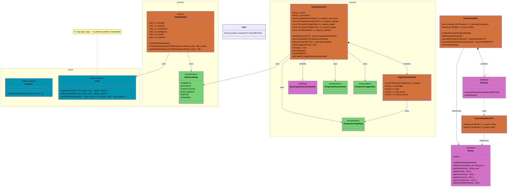

```mermaid
classDiagram


note for Find "T = any type, Args... = a unknow number of parameter"
namespace helper {

    class Random:::styleStatic {
        <<static functions>>

        + getRandomNumber(int min, int max) int
    }

    class Find:::styleStatic {
        <<static functions>>

        + getHighestValue(T first_value, Args... others_values) T
        + getLowestValue(T first_value, Args... others_values) T
        + getValueInRange(const T value, const T min_range, const T max_range) T
    }
}


namespace attribute {

    class AttributeData:::styleClass {
        <<struct>>

        - int8_t m_strength
		- int8_t m_dexterity
		- int8_t m_constitution
		- int8_t m_intelligence
		- int8_t m_wisdom
		- int8_t m_charisma

		+ printAllAttributesData()
		+ setAttributeData(const EAttributeData attribute_type, int8_t value)
		+ getAttributeData(const EAttributeData attribute_type) int8_t
    }

    
    class EAttributeData:::styleEnum {
        <<enumeration>>

        STRENGTH
	    DEXTERITY
	    CONSTITUTION
	    INTELLIGENCE
	    WISDOM
	    CHARISMA
    }
}

AttributeData --> EAttributeData : uses
AttributeData --> Find : uses


https://www.youtube.com/watch?v=HpyVBF03vI8


namespace capacity {
    class CapacitySystem:::styleClass {
        -string m_name
        -string m_description
        -queue~CapacityActionData~ m_capacity_dto_queue
        -vector~ECapacityPurposeData~ m_capacity_purpose
        -vector~ECapacityTargetData~ m_capacity_target
        -vector~ECapacityTriggerData~ m_capacity_trigger
        -vector~EAttributeData~ m_capacity_attribute
        +getAllCapacityDTO() queue~CapacityActionData~
        +queueCapacityDTO(CapacityActionData)
        +getNextCapacityDTO() CapacityActionData
        +isNextCapacityDTO() bool
        +isEmpty() bool
        +printCapacity()
        +setters/getters()
        -addCapacityTarget(CapacityActionData)
    }
    
    class CapacityActionData:::styleClass {
        +vector~ECapacityTargetData~ m_targets
        +uint16_t m_damage
        +uint16_t m_heal
        +uint16_t m_add_armor
        +uint16_t m_remove_armor
    }
    
    class BaseCapacityActionSystem:::styleInterface {
        <<interface>>
    }

    class ECapacityPurposeData:::styleEnum  {
        <<enumeration>>
    }
    
    class ECapacityTargetData:::styleEnum  {
        <<enumeration>>
    }
    
    class ECapacityTriggerData:::styleEnum {
        <<enumeration>>
    }
}
    
class IEntity:::styleInterface {
    <<interface>>
    +updateAttributes(Attribute)
    +addPassive(shared_ptr~IPassive~)
    +getEntityName() string_view
    +getMaxLife() int16_t
    +getCurrentLife() int16_t
    +getMaxArmor() int16_t
    +getCurrentArmor() int16_t
    +getAttribute(EAttribute) int8_t
    +setters...
}
    
class PassiveHandler:::styleClass {
    -vector~shared_ptr~IPassive~~ m_persistent_passives
    -shared_ptr~IEntity~ m_source_entity
    +initializePassiveHandler(IEntity&)
    +addPassive(IPassive&)
    +executePersistentPassives() PassiveModifierDTO
    +executeGettingHitPassives(IEntity&) PassiveModifierDTO
    +printListPassives()
}
    
class IPassive:::styleInterface {
    <<interface>>
    +executePassive(PassiveModifierDTO&)
    +printPassive()
}
    
class PassiveModifierDTO:::styleClass {
    +shared_ptr~IEntity~ m_source_entity
    +shared_ptr~IEntity~ m_target_entity
}
    


    

    

CapacitySystem *--> CapacityActionData : contains
CapacitySystem --> EAttributeData : uses
CapacitySystem --> ECapacityPurposeData : uses
CapacitySystem --> ECapacityTargetData : uses
CapacitySystem --> ECapacityTriggerData : uses
CapacitySystem --|> BaseCapacityActionSystem : extends
    
CapacityActionData --> ECapacityTargetData : uses
    
PassiveHandler *--> "0..*" IPassive : contains
PassiveHandler --> "1" IEntity : references
    
IPassive ..> PassiveModifierDTO : uses
    
PassiveModifierDTO --> IEntity : references
    

classDef styleClass fill:#d3733b,color:#000;
classDef styleStatic fill:#0195af,color:#000;
classDef styleEnum fill:#75d372,color:#000;
classDef styleInterface fill:#d372c5,color:#000;
```