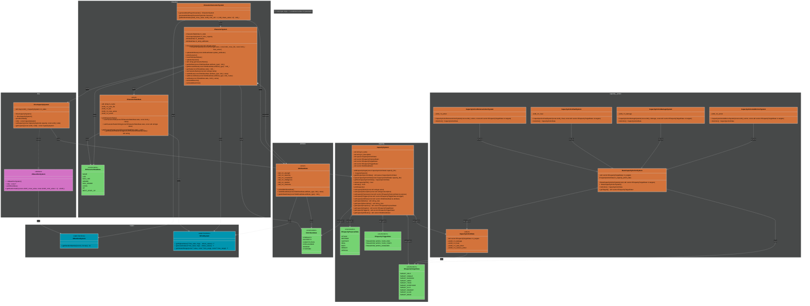

```mermaid
---
config:
  theme: dark
  look: classic
---
classDiagram


note for Find "T = any type, Args... = a unknow number of parameter"


%%%%%%%%%%%%%%%%%%%%%%%%%%%%%%%%%%%%%%%%%%%%%%%%%%%%%%%%%%%%%%
namespace helper {

    class SRandomSystem:::styleStatic {
        <<static functions>>

        + getRandomNumber(int min, int max) int
    }

    class SFindSystem:::styleStatic {
        <<static functions>>

        + getHighestValue(T first_value, Args... others_values) T
        + getLowestValue(T first_value, Args... others_values) T
        + getValueInRange(const T value, const T min_range, const T max_range) T
    }
}


%%%%%%%%%%%%%%%%%%%%%%%%%%%%%%%%%%%%%%%%%%%%%%%%%%%%%%%%%%%%%%
namespace attribute {
    class AttributeData:::styleClass {
        <<struct>>

        - int8_t m_strength
		- int8_t m_dexterity
		- int8_t m_constitution
		- int8_t m_intelligence
		- int8_t m_wisdom
		- int8_t m_charisma

		+ printAllAttributesData()
		+ setAttributeData(const EAttributeData attribute_type, int8_t value)
		+ getAttributeData(const EAttributeData attribute_type) int8_t
    }

    
    class EAttributeData:::styleEnum {
        <<enumeration>>

        STRENGTH
	    DEXTERITY
	    CONSTITUTION
	    INTELLIGENCE
	    WISDOM
	    CHARISMA
    }
}

AttributeData --> EAttributeData : uses
AttributeData --> SFindSystem : uses


%%%%%%%%%%%%%%%%%%%%%%%%%%%%%%%%%%%%%%%%%%%%%%%%%%%%%%%%%%%%%%
namespace character {
    class CharacterSystem:::styleClass {

    	- CharacterStatsData m_stats
		- DiceCapacitySystem m_dice_capacity
		- AttributeData m_attributes
		- AttributeData m_temp_attributes

        + CharacterSystem(const std::string& name)
        + CharacterSystem(const std::string& name, const int16_t max_life, const int16_t max_armor)

        + updateAttributes(const AttributeData& update_attributes)
		+ printcharacter()
		+ resetToDefaultValues()
		+ updatecharacter()

        + std::string getcharacterName()
		+ getAttribute(const EAttributeData attribute_type) int8_t
		+ getBonusAttribute(const EAttributeData attribute_type) int8_t
		+ getStats(const EStatsData stats) int8_t
        + setcharacterName(const std::string& name)			
		+ setAttribute(const EAttributeData attribute_type, int8_t value)
		+ setBonusAttribute(const EAttributeData attribute_type, int8_t value)
		+ setStats(const EStatsData stats, int16_t value)

		- calculateMaxLife()
		- calculateMaxArmor()
	}

    class CharacterStatsData:::styleClass {
        <<struct>>

		- std::string m_name
		- int16_t m_max_life
		- int16_t m_life
		- int16_t m_max_armor
		- int16_t m_armor

		+ printCharacterStats()
		+ setCharacterStats(const ECharacterStatsData stats, const int16_t value)
		+ setCharacterStatsInString(const ECharacterStatsData stats, const std::string& value)
		+ getCharacterStats(const ECharacterStatsData stats) int16_t
		+ getCharacterStatsInString(const ECharacterStatsData stats) std::string
	}

    class ECharacterStatsData:::styleEnum {
        <<enumeration>>

		NAME
		LIFE
		MAX_LIFE
		ARMOR
		MAX_ARMOR
		LEVEL
		XP
		NEXT_LEVEL_XP
	}

	class CharacterGeneratorSystem:::styleClass {

		+ generateNewPlayercharacter() CharacterSystem

		- generateAttributes(CharacterSystem& character)
		- getRandomValue(uint8_t max_value, uint8_t nbr_roll = 1, int8_t base_value = 0) int8_t
	}
}
CharacterSystem --> SFindSystem : uses
CharacterSystem --> EAttributeData : uses
CharacterSystem --> ECharacterStatsData : uses
CharacterSystem --> DiceCapacitySystem : uses
CharacterSystem *--> AttributeData : compose
CharacterSystem --> CharacterStatsData : uses

CharacterStatsData --> SFindSystem : uses
CharacterStatsData --> ECharacterStatsData : uses

CharacterGeneratorSystem --> CharacterSystem : uses
CharacterGeneratorSystem --> AttributeData : uses
CharacterGeneratorSystem --> SRandomSystem : uses


%%%%%%%%%%%%%%%%%%%%%%%%%%%%%%%%%%%%%%%%%%%%%%%%%%%%%%%%%%%%%%
namespace dice {
    class ABaseDiceSystem:::styleAbstract {
        <<abstract>>

        + ~ABaseDiceSystem()
        + roll() const T 
        + printDiceSides()

        # getRandomValue(const uint16_t max_value, const uint16_t min_value = 1) uint16_t
    }

    class DiceCapacitySystem:::styleClass {

        - std::map~uint8_t, CapacitySystem~ m_sides

        + DiceCapacitySystem()
        + ~DiceCapacitySystem()

        + printDiceSides() 
        + roll() const CapacitySystem

        + setCapacity(const CapacitySystem& capacity, const uint8_t side)
        + getCapacity(const uint8_t side) const CapacitySystem*

    }
}

ABaseDiceSystem --> SRandomSystem : uses

DiceCapacitySystem ..|> ABaseDiceSystem : realize
DiceCapacitySystem --> CapacitySystem : uses


%%%%%%%%%%%%%%%%%%%%%%%%%%%%%%%%%%%%%%%%%%%%%%%%%%%%%%%%%%%%%%
namespace capacity__action {
	class BaseCapacityActionSystem:::styleClass {

		- std::vector~ECapacityTargetData~ m_targets

		# CapacityActionData m_capacity_action_data 

		+ BaseCapacityActionSystem(const std::vector~ECapacityTargetData~ & targets)
		+ ~BaseCapacityActionSystem()
		+ doAction() CapacityActionData
		+ getTargets() std::vector~ECapacityTargetData~ 
	}

	class CapacityActionAddArmorSystem:::styleClass {

		- uint8_t m_armor

		+ CapacityActionAddArmorSystem(const uint8_t armor, const std::vector~ECapacityTargetData~ & targets)
		+ doAction() CapacityActionData
	}

    class CapacityActionDamageSystem:::styleClass {

		- uint8_t m_damage

		+ CapacityActionDamageSystem(const uint8_t damage, const std::vector~ECapacityTargetData~ & targets)
		+ doAction() CapacityActionData
	}

	class CapacityActionHealSystem:::styleClass {

		- uint8_t m_heal

		+ CapacityActionHealSystem(const uint8_t heal, const std::vector~ECapacityTargetData~ & targets)
		+ doAction() CapacityActionData
	}

	class CapacityActionRemoveArmorSystem:::styleClass {

		- uint8_t m_armor

		+ CapacityActionRemoveArmorSystem(const uint8_t armor, const std::vector~ECapacityTargetData~ & targets)
		+ doAction() CapacityActionData
	}

    class CapacityActionData:::styleClass {
        <<struct>>

		- std::vector~ECapacityTargetData~ m_targets
		- uint16_t m_damage
		- uint16_t m_heal
		- uint16_t m_add_armor
		- uint16_t m_remove_armor
	}
}

BaseCapacityActionSystem o--> CapacityActionData : agregation
BaseCapacityActionSystem --> ECapacityTargetData : uses

CapacityActionAddArmorSystem --|> BaseCapacityActionSystem : inherits
CapacityActionDamageSystem --|> BaseCapacityActionSystem : inherits
CapacityActionHealSystem --|> BaseCapacityActionSystem : inherits
CapacityActionRemoveArmorSystem --|> BaseCapacityActionSystem : inherits

CapacityActionData --> ECapacityTargetData : uses


%%%%%%%%%%%%%%%%%%%%%%%%%%%%%%%%%%%%%%%%%%%%%%%%%%%%%%%%%%%%%%
namespace capacity {
	class ECapacityPurposeData:::styleEnum {
        <<enumeration>>

		ATTACK
		DEFENSE
		SUPPORT
		HEAL
		BUFF
		DEBUFF
		SPECIAL
	}

	class ECapacityTargetData:::styleEnum {
        <<enumeration>>

		TARGET_SELF
		TARGET_SINGLE
		TARGET_RANDOM
		TARGET_AREA
		TARGET_TEAM
		TARGET_EVERYONE
		TARGET_ALLY
		TARGET_ENNEMY
		TARGET_ALIVE
		TARGET_DEAD
	}

	class ECapacityTriggerData:::styleEnum {
        <<enumeration>>

		TRIGGERED_WHEN_TURN_END,
		TRIGGERED_WHEN_TURN_START,
		TRIGGERED_WHEN_ASSIGNED
	}

	class CapacitySystem:::styleClass {

		- std::string m_name
		- std::string m_description
		- std::queue~CapacityActionData~
		- std::vector~ECapacityPurposeData~
		- std::vector~ECapacityTargetData~
		- std::vector~ECapacityTriggerData~
		- std::vector~EAttributeData~

		- addCapacityTarget(const CapacityActionData& capacity_dto)

		+ ~CapacitySystem()
		+ getAllCapacityActionData() std::queue~CapacityActionData~
		+ queueCapacityActionData(const CapacityActionData& capacity_dto)
		+ getNextCapacityActionData() CapacityActionData
		+ isNextCapacityDTO() bool
		+ isEmpty() bool
		+ printCapacity()

		+ setCapacityName(const std::string& name)
		+ setCapacityDescription(const std::string& description)
		+ setCapacityPurposes(const std::vector~ECapacityPurposeData~& purpose)
		+ setCapacityTriggers(const std::vector~ECapacityTriggerData~& trigger)
		+ setCapacityAttribute(const std::vector~EAttributeData~& attribute)
		
		+ getCapacityName() std::string_view
		+ getCapacityDescription() std::string_view
		+ getCapacityPurposes() std::vector~ECapacityPurposeData~
		+ getCapacityTargets() std::vector~ECapacityTargetData~
		+ getCapacityTriggers() std::vector~ECapacityTriggerData~
		+ getCapacityAttributes() std::vector~EAttributeData~
	}
}

CapacitySystem o--> EAttributeData : agregation
CapacitySystem o--> ECapacityTargetData : agregation
CapacitySystem o--> ECapacityPurposeData : agregation
CapacitySystem o--> ECapacityTriggerData : agregation
CapacitySystem o--> CapacityActionData : agregation
    

%%%%%%%%%%%%%%%%%%%%%%%%%%%%%%%%%%%%%%%%%%%%%%%%%%%%%%%%%%%%%%
classDef styleClass fill:#d3733b,color:#000;
classDef styleInterface fill:#d372c5,color:#000;
classDef styleAbstract fill:#d372c5,color:#000;
classDef styleStatic fill:#0195af,color:#000;
classDef styleEnum fill:#75d372,color:#000;
```