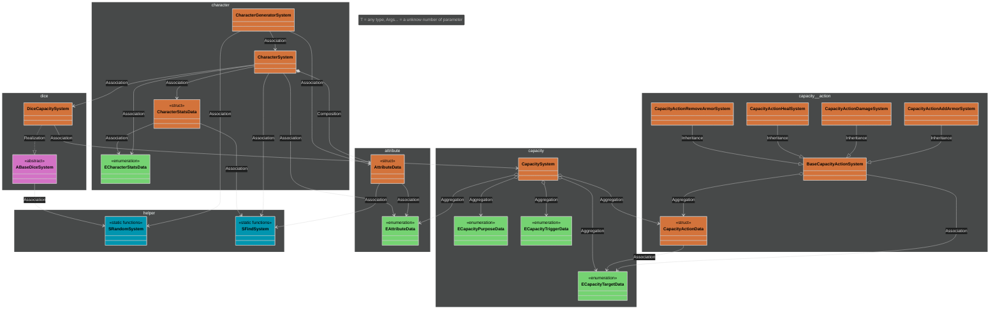

```mermaid
---
config:
  theme: dark
  look: classic
---
classDiagram


note for Find "T = any type, Args... = a unknow number of parameter"


%%%%%%%%%%%%%%%%%%%%%%%%%%%%%%%%%%%%%%%%%%%%%%%%%%%%%%%%%%%%%%
namespace helper {

    class SRandomSystem:::styleStatic {
        <<static functions>>
    }

    class SFindSystem:::styleStatic {
        <<static functions>>
    }
}


%%%%%%%%%%%%%%%%%%%%%%%%%%%%%%%%%%%%%%%%%%%%%%%%%%%%%%%%%%%%%%
namespace attribute {
    class AttributeData:::styleClass {
        <<struct>>
    }

    
    class EAttributeData:::styleEnum {
        <<enumeration>>
    }
}

AttributeData --> EAttributeData : Association
AttributeData --> SFindSystem : Association


%%%%%%%%%%%%%%%%%%%%%%%%%%%%%%%%%%%%%%%%%%%%%%%%%%%%%%%%%%%%%%
namespace character {
    class CharacterSystem:::styleClass {
	}

    class CharacterStatsData:::styleClass {
        <<struct>>
	}

    class ECharacterStatsData:::styleEnum {
        <<enumeration>>
	}

	class CharacterGeneratorSystem:::styleClass {
	}
}
CharacterSystem --> SFindSystem : Association
CharacterSystem --> EAttributeData : Association
CharacterSystem --> ECharacterStatsData : Association
CharacterSystem --> DiceCapacitySystem : Association
CharacterSystem *--> AttributeData : Composition
CharacterSystem --> CharacterStatsData : Association

CharacterStatsData --> SFindSystem : Association
CharacterStatsData --> ECharacterStatsData : Association

CharacterGeneratorSystem --> CharacterSystem : Association
CharacterGeneratorSystem --> AttributeData : Association
CharacterGeneratorSystem --> SRandomSystem : Association


%%%%%%%%%%%%%%%%%%%%%%%%%%%%%%%%%%%%%%%%%%%%%%%%%%%%%%%%%%%%%%
namespace dice {
    class ABaseDiceSystem:::styleAbstract {
        <<abstract>>
    }

    class DiceCapacitySystem:::styleClass {
    }
}

ABaseDiceSystem --> SRandomSystem : Association

DiceCapacitySystem ..|> ABaseDiceSystem : Realization
DiceCapacitySystem --> CapacitySystem : Association


%%%%%%%%%%%%%%%%%%%%%%%%%%%%%%%%%%%%%%%%%%%%%%%%%%%%%%%%%%%%%%
namespace capacity__action {
	class BaseCapacityActionSystem:::styleClass {
	}

	class CapacityActionAddArmorSystem:::styleClass {
	}

    class CapacityActionDamageSystem:::styleClass {
	}

	class CapacityActionHealSystem:::styleClass {
	}

	class CapacityActionRemoveArmorSystem:::styleClass {
	}

    class CapacityActionData:::styleClass {
        <<struct>>
	}
}

BaseCapacityActionSystem o--> CapacityActionData : Aggregation
BaseCapacityActionSystem --> ECapacityTargetData : Association

CapacityActionAddArmorSystem --|> BaseCapacityActionSystem : Inheritance
CapacityActionDamageSystem --|> BaseCapacityActionSystem : Inheritance
CapacityActionHealSystem --|> BaseCapacityActionSystem : Inheritance
CapacityActionRemoveArmorSystem --|> BaseCapacityActionSystem : Inheritance

CapacityActionData --> ECapacityTargetData : Association


%%%%%%%%%%%%%%%%%%%%%%%%%%%%%%%%%%%%%%%%%%%%%%%%%%%%%%%%%%%%%%
namespace capacity {
	class ECapacityPurposeData:::styleEnum {
        <<enumeration>>
	}

	class ECapacityTargetData:::styleEnum {
        <<enumeration>>
	}

	class ECapacityTriggerData:::styleEnum {
        <<enumeration>>
	}

	class CapacitySystem:::styleClass {
	}
}

CapacitySystem o--> EAttributeData : Aggregation
CapacitySystem o--> ECapacityTargetData : Aggregation
CapacitySystem o--> ECapacityPurposeData : Aggregation
CapacitySystem o--> ECapacityTriggerData : Aggregation
CapacitySystem o--> CapacityActionData : Aggregation
    

%%%%%%%%%%%%%%%%%%%%%%%%%%%%%%%%%%%%%%%%%%%%%%%%%%%%%%%%%%%%%%
classDef styleClass fill:#d3733b,color:#000;
classDef styleInterface fill:#d372c5,color:#000;
classDef styleAbstract fill:#d372c5,color:#000;
classDef styleStatic fill:#0195af,color:#000;
classDef styleEnum fill:#75d372,color:#000;
```