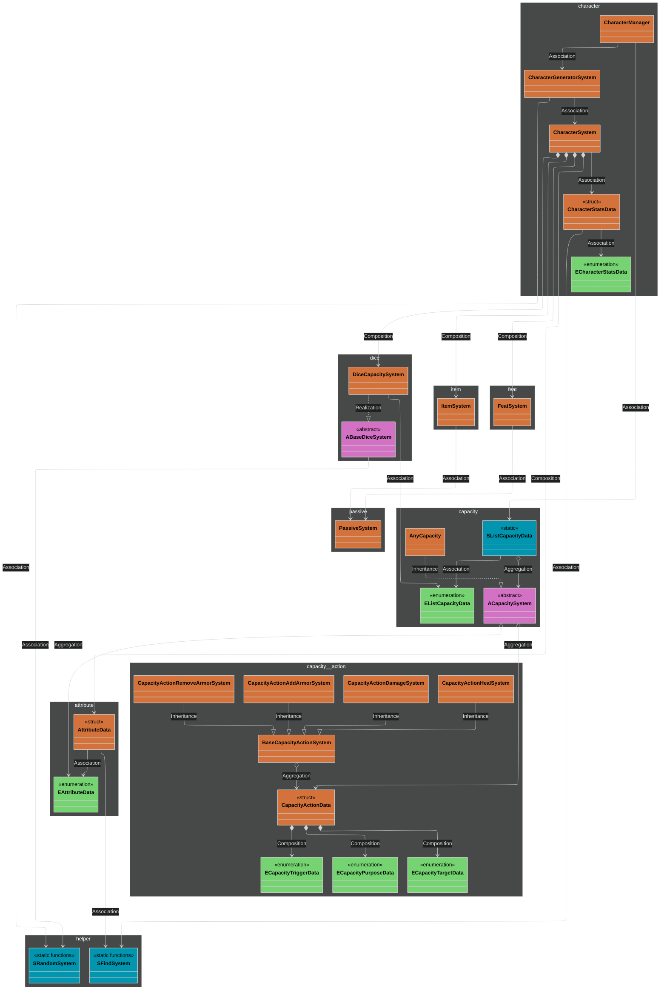

```mermaid
---
config:
  theme: dark
  look: classic
  layout: elk
---
classDiagram
%%
namespace helper {
    class SRandomSystem:::styleStatic {
        <<static functions>>
    }
    class SFindSystem:::styleStatic {
        <<static functions>>
    }
}
%%
namespace attribute {
    class AttributeData:::styleClass {
        <<struct>>
    }
    class EAttributeData:::styleEnum {
        <<enumeration>>
    }
}
AttributeData --> EAttributeData : Association
AttributeData --> SFindSystem : Association
%%
namespace dice {
    class ABaseDiceSystem:::styleAbstract {
        <<abstract>>
    }
    class DiceCapacitySystem:::styleClass {
    }
}
ABaseDiceSystem --> SRandomSystem : Association
DiceCapacitySystem ..|> ABaseDiceSystem : Realization
DiceCapacitySystem --> EListCapacityData : Association
%%
namespace item {
    class ItemSystem:::styleClass {
    }
}
ItemSystem --> PassiveSystem : Association
%%
namespace feat {
    class FeatSystem:::styleClass {
    }
}
FeatSystem --> PassiveSystem : Association
%%
namespace passive {
    class PassiveSystem:::styleClass {
    }
}
%%
namespace character {
    class CharacterSystem:::styleClass {
	}
    class CharacterStatsData:::styleClass {
        <<struct>>
	}
    class ECharacterStatsData:::styleEnum {
        <<enumeration>>
	}
	class CharacterGeneratorSystem:::styleClass {
	}
    class CharacterManager:::styleClass { 
    }
}
CharacterSystem *--> AttributeData : Composition
CharacterSystem *--> DiceCapacitySystem : Composition
CharacterSystem *--> ItemSystem : Composition
CharacterSystem *--> FeatSystem : Composition
CharacterSystem --> CharacterStatsData : Association
CharacterStatsData --> SFindSystem : Association
CharacterStatsData --> ECharacterStatsData : Association
CharacterGeneratorSystem --> CharacterSystem : Association
CharacterGeneratorSystem --> SRandomSystem : Association
CharacterManager --> CharacterGeneratorSystem : Association
CharacterManager --> SListCapacityData : Association
%%
namespace capacity__action {
    class ECapacityPurposeData:::styleEnum {
        <<enumeration>>
	}
	class ECapacityTargetData:::styleEnum {
        <<enumeration>>
	}
	class ECapacityTriggerData:::styleEnum {
        <<enumeration>>
	}
	class BaseCapacityActionSystem:::styleClass {
	}
	class CapacityActionAddArmorSystem:::styleClass {
	}
    class CapacityActionDamageSystem:::styleClass {
	}
	class CapacityActionHealSystem:::styleClass {
	}
	class CapacityActionRemoveArmorSystem:::styleClass {
	}
    class CapacityActionData:::styleClass {
        <<struct>>
	}
}
BaseCapacityActionSystem o--> CapacityActionData : Aggregation
CapacityActionAddArmorSystem --|> BaseCapacityActionSystem : Inheritance
CapacityActionDamageSystem --|> BaseCapacityActionSystem : Inheritance
CapacityActionHealSystem --|> BaseCapacityActionSystem : Inheritance
CapacityActionRemoveArmorSystem --|> BaseCapacityActionSystem : Inheritance
CapacityActionData *--> ECapacityTargetData : Composition
CapacityActionData *--> ECapacityPurposeData : Composition
CapacityActionData *--> ECapacityTriggerData : Composition
%%
namespace capacity {
	class ACapacitySystem:::styleAbstract {
        <<abstract>>
	}
    class AnyCapacity:::styleClass{

    }
    class SListCapacityData:::styleStatic {
        <<static>>
	}
    class EListCapacityData:::styleEnum {
        <<enumeration>>
	}
}
ACapacitySystem o--> EAttributeData : Aggregation
ACapacitySystem o--> CapacityActionData : Aggregation
AnyCapacity ..|> ACapacitySystem : Inheritance
SListCapacityData --> EListCapacityData : Association
SListCapacityData o--> ACapacitySystem : Aggregation
%%
classDef styleClass fill:#d3733b,color:#000;
classDef styleInterface fill:#d372c5,color:#000;
classDef styleAbstract fill:#d372c5,color:#000;
classDef styleStatic fill:#0195af,color:#000;
classDef styleEnum fill:#75d372,color:#000;
```

```
